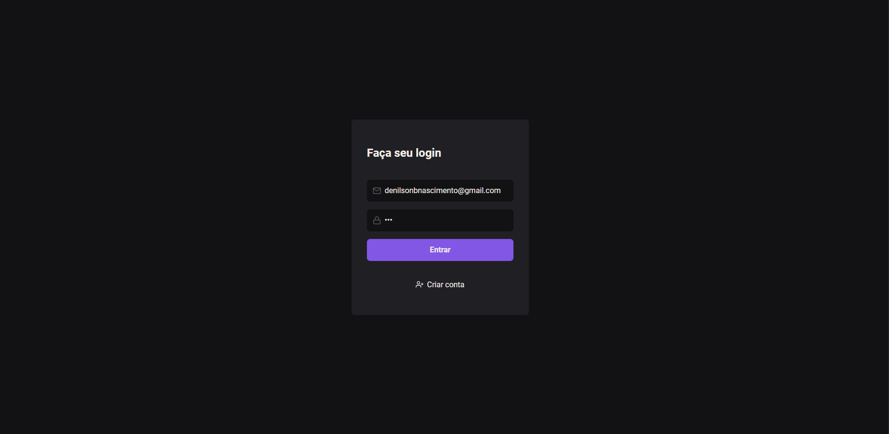
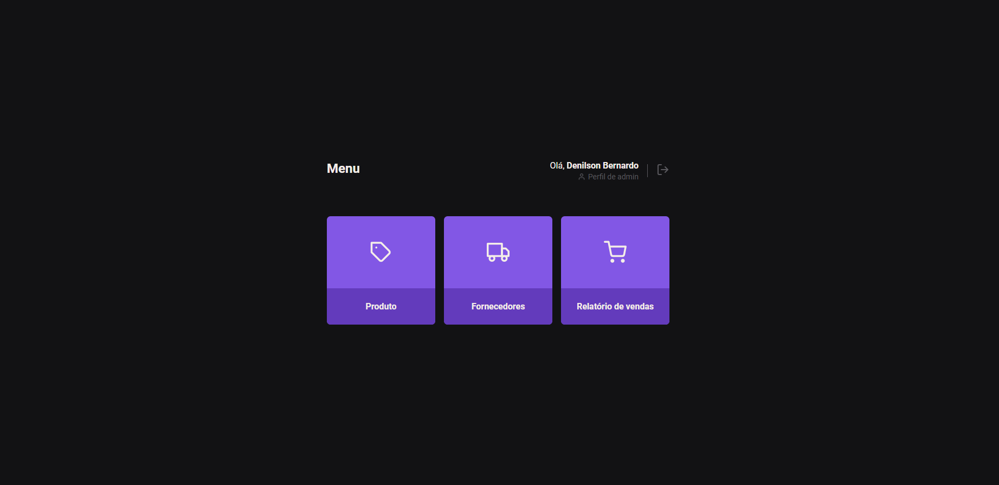

## Front-end

### Organização de Rota
- Organização das rotas na aplicação, separando-as em arquivos diferentes e ajustando os acessos permitidos com base nos perfis dos usuários.

### Distribuição de Rota por Perfil
- Distribuição das rotas de acordo com o perfil do usuário, utilizando a estrutura de switch case e criando uma função chamada `accessRoute`.

### Ocultação de Opção de Menu
- Utilização do hook `useAuth` para obter informações do usuário e ocultar ou mostrar opções ou funcionalidades como botões, ícones, etc. Com base no perfil do usuário.

### Consumo do Token que é Enviado pelo Cookie nas Requisições
- Consumir o token enviado pelo cookie nas requisições, garantindo a continuidade da autenticação e autorização no front-end.

### Propriedade "withCredentials"
- Utilização da propriedade "withCredentials" para incluir cookies nas requisições, mantendo a integridade da autenticação entre o front-end e o back-end.

## Conclusão
Essas implementações e aprendizados me proporcionaram uma compreensão mais profunda sobre o controle de acesso e autenticação em um projeto.